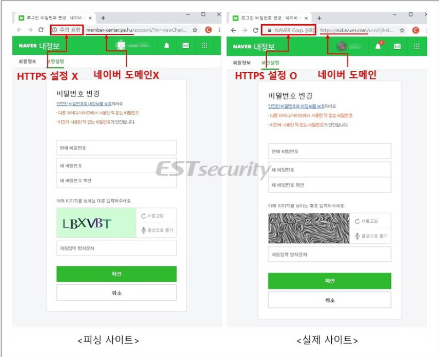
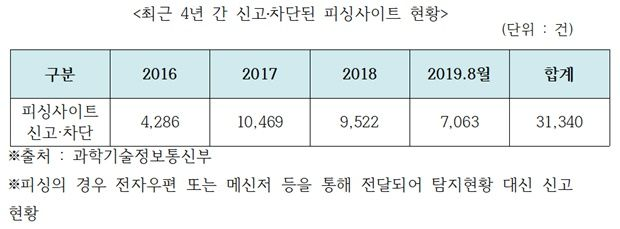
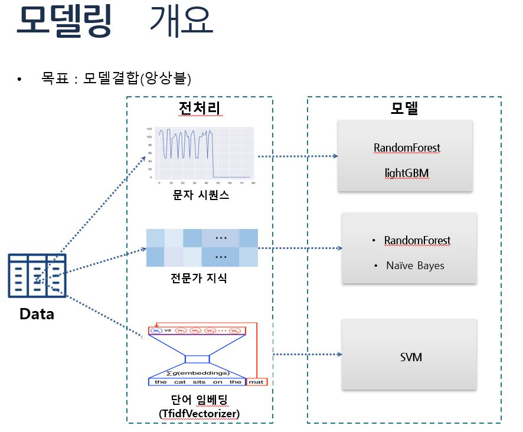

# 피싱URL 분류문제 (머신러닝을 이용한)

### 배경
- 피싱 사이트란?
 - 가짜 사이트를 통해 가용자의 개인정보 및 금융정보를 탈취하는 사기 수법
 - 예금 인출, 결제 대납, 명의 도용, 스펨 메세지 등의 피해발생

- '피싱 사이트' 현황 (최근 4년간)
 - 2017년, 전년 대비 2.4배 증가.
 - 이후 증가추세는 완화되었으나, 약 1만여건씩 꾸준히 신고, 차단됨
 - 2019년 말 기준, 1만 건 넘길 것으로 예상됨 (2019년 8월 기준 7천여건)

 
**위와 같은 문제를 해결하기 위해 url만을 보고 정상 URL과 피싱 URL을 분류할 필요가 있음

### 모델링 개요

### 예측결과결합
 - '다수결'방법과 '가중치'방법이 2가지가 있다.

